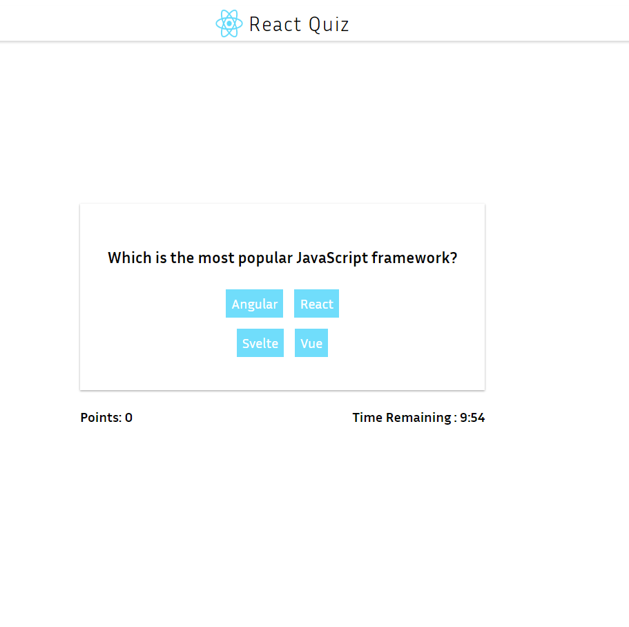
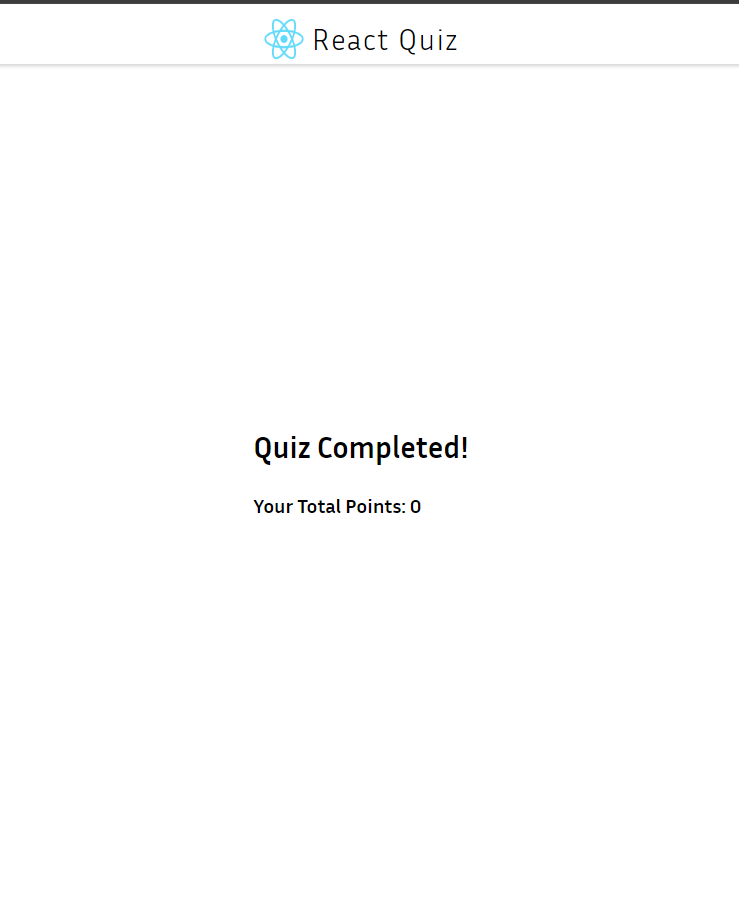

# React Quiz Application

This is a simple quiz application built using React, designed to help developers understand and practice using the `useReducer` hook for state management. The app allows users to take a quiz with multiple questions, keeps track of points, and has a countdown timer that ends the quiz when time runs out.

## Features

- **Dynamic quiz questions**: Fetches questions from an API.
- **Points tracking**: Updates points based on correct and incorrect answers.
- **Countdown Timer**: 10-minute timer that ends the quiz when it runs out.
- **Progression Control**: Next button appears after answering a question.
- **Status bar**: Displays current points and remaining time.

## Screenshots

### 1. **Quiz Ready Screen**

This screen shows when the quiz data is loaded and ready to begin.

### 2. **Question Screen with Timer and Points**

The main quiz screen displays the question, current points, and remaining time.

### 3. **End Screen**

HAHA, The point is zero , cause for each incorrect answer , Im reducing the points by 5 :)

Once the quiz is completed or the time is up, the end screen is shown with total points.

## Learning Objectives

This project is designed for learners to:

- Understand how the `useReducer` hook can be used to manage complex state logic.
- Learn how to trigger state transitions based on actions like answering questions, fetching data, and handling a timer.
- Practice updating UI elements based on state changes.

## Technologies Used

- **React**: Frontend library for building UI.
- **useReducer Hook**: For managing application state transitions.
- **CSS**: For styling the UI components.
- **Fetch API**: To load quiz questions from a backend or API.
- **JSON SERVER**: Manually mocking a JSON file as API source.
